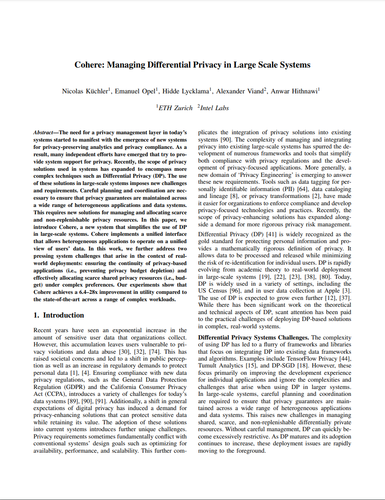

[![ArXiv][arxiv-shield]][arxiv-url]
[![IEEE][ieee-shield]][ieee-url]


<!-- PROJECT LOGO -->
<br />

<div align="center">
  <a href="https://arxiv.org/pdf/2301.08517.pdf">
    
  </a>

  <h3 align="center">Cohere: Managing Differential Privacy in Large Scale Systems</h3>

  <p align="center">
    <b>This repository contains the artifact for the IEEE S&P 2024 paper:</b>
  </p>


  N. Küchler, E. Opel, H. Lycklama, A. Viand, and A. Hithnawi,
  "Cohere: Managing Differential Privacy in Large Scale Systems" <br>
in 2024 IEEE Symposium on Security and Privacy (SP), San Francisco, CA, USA, 2024

  <div align="left">
  <details>
<summary>
Bibtex
</summary>


```
@INPROCEEDINGS {Kuchler2024-dpcohere,
    author = {Küchler, Nicolas and Opel, Emanuel and Lycklama, Hidde and Viand, Alexander and Hithnawi, Anwar},
    booktitle = {2024 IEEE Symposium on Security and Privacy (SP)},
    title = {Cohere: Managing Differential Privacy in Large Scale Systems},
    year = {2024},
    volume = {},
    issn = {2375-1207},
    pages = {122-122},
    url = {https://doi.ieeecomputersociety.org/10.1109/SP54263.2024.00122},
    publisher = {IEEE Computer Society},
    address = {Los Alamitos, CA, USA},
    month = {may}
}
```


</details>
</div>
</div>


<!-- ABOUT THE PROJECT -->
## About The Project


The existing implementation of Cohere serves as an academic prototype primarily focusing on the [DP resource planner](dp-planner).
This component is the core of Cohere's design and effectively handles most of the complexity of DP management.
In addition, we provide:

- A [hyperparameter explorer](hyperparam-explorer) for investigating parameter tradeoffs and assessing the suitability of Cohere in different scenarios.
- A customizable [workload generator](workload-simulator) enabling the creation of complex mixed workloads of DP applications.
- A [request adapter](request-adapter) showcasing the generation of Cohere requests directly from [Tumult Analytics](https://www.tmlt.dev/), a DP library designed for aggregate queries on tabular data,  as well as [Opacus](https://opacus.ai/), a PyTorch-based DP library for ML training.

The evaluation of Cohere is orchestrated with the [doe-suite](https://github.com/nicolas-kuechler/doe-suite) experiment management tool, with configuration details available in [doe-suite-config](doe-suite-config).


<!-- GETTING STARTED -->
## Getting Started

Get started by installing and running the [DP resource planner](dp-planner) on your local machine.
For this, we include a [basic workload](dp-planner/resources/applications/minimal) in the repository.
If you need more complex workloads, you can use the [workload generator](workload-simulator).

To reproduce the paper's results on AWS or a SLURM-based scientific compute cluster, check out the documentation in [doe-suite-config](doe-suite-config).


<!-- CONTACT -->
## Contact

- [Nicolas Küchler](https://pps-lab.com/people/nicolaskuechler/) ([nicolas-kuechler](https://github.com/nicolas-kuechler))

- [Emanuel Opel](https://emanuelopel.ch/) ([e-opel](https://github.com/e-opel))

- [Hidde Lycklama](https://pps-lab.com/people/hiddelycklama/) ([hiddely](https://github.com/hiddely))

- [Alexander Viand](https://viand.ch) ([AlexanderViand](https://github.com/AlexanderViand))

- [Anwar Hithnawi](https://pps-lab.com/people/anwarhithnawi/) ([Anwarhit](https://github.com/Anwarhit))


<!-- MARKDOWN LINKS & IMAGES -->
[arxiv-shield]: https://img.shields.io/badge/arXiv-2301.08517-green?style=for-the-badge&logo=arxiv
[arxiv-url]: https://arxiv.org/abs/2301.08517

[ieee-shield]: https://img.shields.io/badge/IEEE-SP46215.2023.10179400-informational?style=for-the-badge&logo=ieee&link=https://www.computer.org/csdl/proceedings-article/sp/2023/933600a453/1OXH4IzyXF6
[ieee-url]: https://doi.ieeecomputersociety.org/10.1109/SP54263.2024.00122
